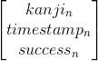

# Jomo Optimized
Notes, ramblings and errata from the life of one engineer


## 2019-1-3 Machine Learning for Self Reflection
I study Japanese as a hobby. I'm not good at it but it makes me happy and I find it relaxing. Over the recent holiday this hobby suddenly overlapped with my interest in machine learning when I realized ML can be used to model and visualize my own mental processeses. **The result is a kind of algorithmic introspection**. 

This graph, which I explain below, shows a neural network as it learns to predict when I will forget particular facts I've learned about Japanese.


### The Joy of Kanji
Part of learning Japanese is the daunting task of memorizing the meanings of 2136 commonly used logographic characters known as jōyō kanji (常用漢字). For example,

``` 
常 - Normal pronounced じょう/jō
用 - Use pronounced よう/yō
漢 - Chinese pronounced かん/kan
字 - Character pronounced じ/ji
```

I've used various tools over time to help me with this task and the most helpful to me has been [Wanikani](wanikani.com).
This is basically a flashcard system where I am prompted with kanji and I'm required to write it's meaning or pronunciation.
I've used Wanikani for more than a year and have learned nearly 1000 kanji to varying levels of competency. 

### Spaced Repetition System (SRS)
After a while I became curious about how Wanikani worked under the covers. 

I could tell the system was trying to figure out some kind of good order. It often didn't quiz me on kanji that I knew pretty well and it quizzed me more often on the kanji that I struggled most with. 

How does Wanikani decide which kanji to test me on next? It is optimal in some way? 

This led me to the personal discovery that there is a fairly sophisticated science behind this kind of thing. It's called SRS (Spaced Repitition System) if you want to search more about it. The main model they use is that when you learn something there is an increasing chance you will forget it over time.

> 

> _- uploaded by Icez at English Wikipedia, Public Domain_

Each time you review the material the forgetting curve gets more shallow until eventually it will decay slowly enough to last the rest of your life. 

### Quirks and Rough Edges
> All models are wrong; some models are useful.
> -George Box, 1976

After more than a year with Wanikani I had become familiar with it's quirks and rough edges. 
- Once it became convinced I had learned ("Burned") something completely it would stop quizzing me altogether. However, there were some that I knew I was going to forget later. 
- On the other hand, I noticed sometimes when I was really bad on a particular case it would seem to give up. But I would have preferred to be quizzed more often so that I had a better chance of learning.
- The spacing between repititions seems to be a hard-coded increasing pattern. But surely my optimal spacing would be different from someone elses. For example, a native Chinese speaker may be able to go faster because they grew up in an environment with logographic characters.

### Are Other Models Useful?
I wondered about a different model of forgetting where there is a precise moment that you forget rather than a probability curve. 

Maybe the curve in the forgetting curve model is about the model's uncertainty about whether you will remember something rather than an accurate reflection of the biological process of forgetting. 

**I became curious about whether a neural network could learn the forgetting curve.**

Wanikani is a great platform and it even has an API that you can use to query your quiz history. I used this to capture a set of tuples:



Since it is a time-series my first thought was to use LSTM to model it. Maybe this is possible but I couldn't figure it out. The problem I had is that LSTM is typically for fixed time windows but the time span between quizzes is variable.

Instead, I tried this as the input to the model:


Where the output trained for is success[n].


#### 2015-6-21 Some Matrix and Vector Functions
Here is a function to create a vector and another to create a transposed vector in TypeScript
```typescript
function matrix(height, width, fn) : number[][] {
  return range(height,
    i=>range(width,
      j=> fn(i, j)))
}

function vector(height, fn) : number[][] {
    return matrix(height, 1, (i,j) => fn(i))
}

function vectort(width, fn) : number[][] {
    return matrix(1, width, (i,j) => fn(j))
}
```
Examples,


Javacript output: [ [ 0 ], [ 2 ], [ 4 ], [ 6 ], [ 8 ] ]


Javacript output: [ [ 0, 2, 4, 6, 8 ] ]


Javascript output: [ [ 0, 0, 0 ], [ 1, 1, 1 ], [ 2, 2, 2 ], [ 3, 3, 3 ] ]

Here is matrix dot product in TypeScript. It requires the 'range' function defined earlier.
```typescript
// TypeScript matrix dot product
// by Jomo Fisher
function dot(a:number[][], b:number[][]) : number[][] {
  console.assert(a[0].length == b.length, "%s wrong dimension for %s", a, b)
  return matrix(a.length, b[0].length, 
    (i, j) => range(a[0].length, k => a[i][k] * b[k][j])
      .reduce((p, c)=> p + c, 0))
}
```

#### 2015-6-19.1 Multivariable Logistic Regression
I showed linear regression in TypeScript a few days ago. Logistic regressions is very similar, all that is required is a transformation of the hypothesis equation to 1/(1 + exp(-z)) where z is the old linear expression. The result is a number in [0,1]. Logistic regression can be viewed as a single neuron in an artificial neural network.

Intuitions:
- The new hypothesis function is a sigmoid. It squashes the answer into a range.
- Not all hypothesis functions have gradient descent solutions that work in the same form

```typescript
/ TypeScript multivariable logistic regression using gradient descent
// - y is 0 or 1
// by Jomo Fisher
function logistic(y : number[], x : number[][], iterations : number) {
	var [xnorm, μ, σ] = normalize(x)
	x = xnorm.map(a=>[1].concat(a))

	var m = x[0].length
	var sum = f => y.reduce((s,_,i) => s + f(i), 0)
	var Θ = range(m, _ => 0)
	var h = i => 1 / (1 + Math.exp(-Θ.reduce((p, c, j) => p += c * x[i][j], 0)))
	var α = 0.01 / m
	
	range(iterations, _ => 
		Θ = Θ.map((Θj, j)=> 
			Θj - α * sum(i=>(h(i) - y[i]) * x[i][j])))
			
	return (...arr) => 1 / (1 + Math.exp(-arr.reduce((p, c, j) => 
		p + Θ[j + 1] * (c - μ[j]) / σ[j], Θ[0])))
}
```

#### 2015-6-19 Converting from Binary to Gray Code
There is a simple conversion from binary to gray code.
```typescript
function graycode(n) {
	return n ^ (n >> 1)
}
```

```text
0 => 0
1 => 1
2 => 3
3 => 2
4 => 6
5 => 7
6 => 5
7 => 4
8 => 12
9 => 13
10 => 15
11 => 14
12 => 10
13 => 11
14 => 9
15 => 8
```

#### 2015-6-14 Multivariable Linear Regression using Gradient Descent
Simple multivariable linear regression in type script.
- y is the desired output
- x is the input features (one feature type per column)
- μ are the means of features
- σ are the standard deviations of features
- Θ is the set of parameters to the model. This is what is trained.
- α is the update scale
- h is the training hypothesis
The return value of the linear() function is a function that can be called to execute the model against the trained parameters.

Intuitions:
- Training data with different units need to be normalized
- Set up a system of equations to minimize (a cost function)
- Can use gradient descent to minimize iteratively
- Multivariable linear regression is a generalization of least squares fit which is a generalization of interpolation

```typescript
// TypeScript multivariable linear regression using gradient descent
// by Jomo Fisher
function linear(y : number[], x : number[][], iterations : number) {
	var [xnorm, μ, σ] = normalize(x)
	x = xnorm.map(a=>[1].concat(a))

	var m = x[0].length
	var sum = f => y.reduce((s,_,i) => s + f(i), 0)
	var Θ = range(m, _ => 0)
	var h = i => Θ.reduce((p, c, j) => p += c * x[i][j], 0)
	var α = 0.01 / m
	
	range(iterations, _ => 
		Θ = Θ.map((Θj, j)=> 
			Θj - α * sum(i=>(h(i) - y[i]) * x[i][j])))
			
	return (...arr) => arr.reduce((p, c, j) => 
		p + Θ[j + 1] * (c - μ[j]) / σ[j], Θ[0])
}
```

#### 2015-6-14 Feature Normalization
Various forms of multivariable regression perform much better when features are normalized. One method of normalization is to subtract the mean from each feature datum and then divide the result by standard deviation. This gives a result that is mostly between -2 and 2 with allowance for outliers.

Intuitions:
- Units are cancelled so the final regression result is also unitless
- Subtracting mean balances positive and negative
- Dividing by standard deviation normalizes scale (and cancels units)

```typescript
// TypeScript feature normalize. Feature data is in columns.
// by Jomo Fisher
function normalize(data : number[][]) {
	var zeros = range(data[0].length, _ => 0)	
	var reduce = (data, fn) => data.reduce((p, c) => p.map(
		(_,i) => fn(p[i], c[i])), zeros)
		.map(s => s / data.length)
	var map = (data, fn) => data.map(row => row.map(fn))
	
	var μ = reduce(data, (p, c) => p + c)
	var zeroed = map(data, (c, i) => c - μ[i])
	var σ = reduce(zeroed, (p, c) => p + c * c).map(Math.sqrt)
	return [map(zeroed, (c, i) => c == 0 ? 0 : c / σ[i]), μ, σ]
}
```

#### 2015-6-13.1 Range function
This range function is handy for writing concise TypeScript. It generates a dense array of size n and calls a function on each element.

```typescript 
function range(high, fn) {
	return Array.apply(0, Array(high)).map((_,i)=>fn(i))
}
```
#### 2015-6-13 Generate Permutations
Here's how to generate permutations of an array. The O(n!) nature is evident by the recursion inside a for-loop for decreasing n. There is one swap per iteration. The bit about n % 2 * i can be read as 'i when n is odd and 0 otherwise'.

```typescript
// TypeScript calls function for each permutation done by Heap's algorithm
function permute(n, a, f) {
	if (--n == 0) return f(a)
	var swap = m => {
		var hold = a[m]
		a[m] = a[n]
		a[n] = hold;	
	}
	for(var i = 0; i <= n; ++i) {
		permute(n, a, f)
		swap(n % 2 * i)
	}
}
```

#### 2015-6-11 How to do Linear Interpolation (then Least Squares)
Given a line formed by [x1,y1] and [x2,y2] find the value y falling on that line for any given x.


```java
  // Java implementation of linear interpolation from two points
  double interpolate(double x, double x1, double y1, double x2, double y2) {
    return ((y2 - y1) * (x - x1)) / (x2 - x1) + y1;
  }
```
One way to generalize interpolation is through simple least squares regression. The following code for linear regression will degenerate to linear interpolation when there are only two points.

```typescript
// TypeScript implementation of least-squares fit (by Jomo Fisher)
function leastSquares(points) {	
  var sum = f => points.reduce((s,c) => s + f(c), 0)
  var n = points.length
  var mx = sum(p => p.x) / n
  var my = sum(p => p.y) / n
  var covariance = sum(p => (p.x - mx) * (p.y - my))	
  var variance = sum(p => (p.x - mx) * (p.x - mx))	
  var m = covariance / variance;
  return {m : m, b : my - m * mx};
}
``` 
This is a cool snippet because it also includes the algorithms for variance and covariance.


#### 2015-6-9 How to Throttle on Client to a Certain QPS
Uses a control loop to settle at certain sleep rate.

```java
  // Throttle QPS with Control Loop
  private static Long longPeriodMillis = null;
  private static long queries = 0;
  private static double allowedQps = 20.0;
  private static double delayMillis = 1000.0 / allowedQps; 
  
  @VisibleForTesting
  public static void throttle() {
 
    synchronized (global) {
      ++queries;
      if (longPeriodMillis == null) {
        longPeriodMillis = System.nanoTime();
        return;
      }
      
      double longPeriodQps = queries / ((System.nanoTime() - longPeriodMillis) / 1000000000.0);
      
      // This creates a feedback loop that will tune to the requested QPS
      if (longPeriodQps > allowedQps) {
        delayMillis *= 1.01;
      } else {
        delayMillis *= 0.99;
      }
     
      if (delayMillis > 1.0) {
        System.out.printf("SleptEntity:%s for qps %s\n", delayMillis, longPeriodQps);
         try {
          Thread.sleep((long) delayMillis);
        } catch (InterruptedException e) {
          e.printStackTrace();
        }
      }
    }
  }
```


#### 2015-6-8 Learned how to embed formulas
Edit them here and get an html link: http://www.codecogs.com/latex/eqneditor.php


#### 2015-6-8 Reading The Bayesian Bootstrap
[http://projecteuclid.org/download/pdf_1/euclid.aos/1176345338]

The main cool trick here is to generate a set of n numbers in [0, 1] that add up to 1.0. Here are the steps:

(1) Generate n-1 random numbers in [0,1]

(2) Sort those numbers ascending

(3) Prepend 0 and append 1 to those numbers and call this list S

(4) Create a new set N where the i-th element is S[i+1] - S[i]
```typescript
// Bayesian bootstrap distribution generator in TypeScript
var n = 100;
var seed = Array.apply(0, Array(100));
var S : number[] = seed
    .map(Math.random)
    .sort();
S[0] = 0.0;
S.push(1.0);
var N = seed.map((_:any, i:number) => S[i+1] - S[i]);
```
Set N consists of numbers in [0,1] that sum to 1.0. Intuitively, this is similar to creating a random CDF (cumulative distribution function).

Bayesian bootstrapping involves creating many sets N and applying them as weights to each element of the sample population under consideration. Interpretation is that N[i] is probability that X[i] is in the bootstrap.


#### 2015-6-3 Reading The Practical Implementation of Bayesian Model Selection
[http://www-stat.wharton.upenn.edu/~edgeorge/Research_papers/ims.pdf]

